<div align="center">

# DevHub

**Your team's tasks, leave, docs and personal to-dos in one place.**

A team management dashboard for small and mid-sized software teams:
who is working on what, which work is late, who is on leave, what I need to do today; all on the same screen.

[Türkçe](README.md) · **English**


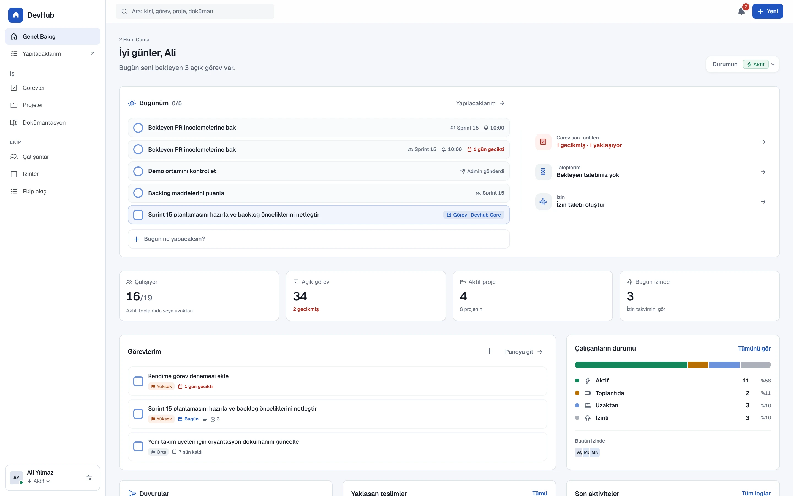

<sub>The interface is in Turkish. Menu names are given below with their English meaning.</sub>

</div>

---

## Contents

- [What you can do](#what-you-can-do)
- [Quick start](#quick-start)
- [User guide](#user-guide)
- [Employee and admin](#employee-and-admin)
- [Tips](#tips)
- [Troubleshooting](#troubleshooting)

## What you can do

| | |
|---|---|
| **Tasks** | See everyone's work on the people board or every task in one table. Assign unassigned work in one click. Add subtasks, labels, file attachments and "can't start until" dependencies. |
| **Effort tracking** | Every task gets an estimate; working time is counted automatically while the task is "in progress". Estimate and actual time are shown side by side. |
| **Personal to-dos** | Your own cards, lists and a two-week plan. Lists can be shared with teammates. |
| **Support tickets** | Employees send their needs (something broken, access, equipment) to management; admins assign and track them. The resolution target is calculated from the priority in working hours; a ticket can be turned into a task. |
| **Leave** | Leave requests, admin approval and a two-week team calendar. Annual leave entitlement is calculated from the hire date. |
| **Surveys** | Admins send surveys to everyone, a department or chosen people. Anonymous option, deadline, reminders and charted results. |
| **Documentation** | Write and edit the team handbook in the app. Employees' changes are published after an admin approves them. |
| **Live notifications** | Know when a task is assigned to you, your leave is approved or someone comments on your card, without refreshing. |
| **Administration** | User accounts, reports, a detailed audit log (exportable to Excel), system health and automatic database backups. |
| **Light and dark theme** | Chosen per device, even from the sign-in screen. |

## Quick start

All you need is **[Docker Desktop](https://www.docker.com/products/docker-desktop/)**. No Java, Node.js or MySQL installation; everything runs inside Docker.

```bash
git clone https://github.com/Hazallul/devhub.git
cd devhub/devhub
docker compose up -d --build
```

The first start takes a few minutes while packages are downloaded. Then open:

**http://localhost:5173**

Press **Yönetici** (admin) or **Çalışan** (employee) at the bottom of the sign-in card to sign in with a sample account in one click. Sign out and use the other button to try both roles.

<details>
<summary>Richer sample data</summary>

Fills projects, tasks, leave and announcements with sample data dated relative to today (overwrites existing data):

```bash
docker exec -i devhub-mysql mysql -uroot -proot --default-character-set=utf8mb4 devhub < scripts/demo-data.sql
```

Then, for departments, labels, subtasks, support tickets and surveys (needs Python 3; running it again does not duplicate anything):

```bash
python scripts/demo-extras.py
```

</details>

<details>
<summary>Stop and restart</summary>

```bash
docker compose stop      # stops, data is kept
docker compose start     # starts again
docker compose down -v   # removes everything, including the database
```

</details>

<details>
<summary>Faster production mode</summary>

The command above runs the interface in development mode: pages reload when the code changes, but each page takes a few seconds to compile the first time it opens. To just use or demo DevHub, run production mode, which builds the interface once and serves the ready files; pages open instantly and the addresses stay the same:

```bash
docker compose -f docker-compose.yml -f docker-compose.prod.yml up -d --build
```

Production mode has no one-click sign-in buttons (a real installation should not leave a password-free way in). Sign in with a sample account's e-mail and password; the password is in `frontend/.env.development`. Run the first command again to return to development mode.

</details>

| Address | What is there |
|---|---|
| http://localhost:5173 | DevHub |
| http://localhost:8025 | Test mailbox (password reset codes land here; no real email is sent) |

## User guide

### Sign in and forgotten password

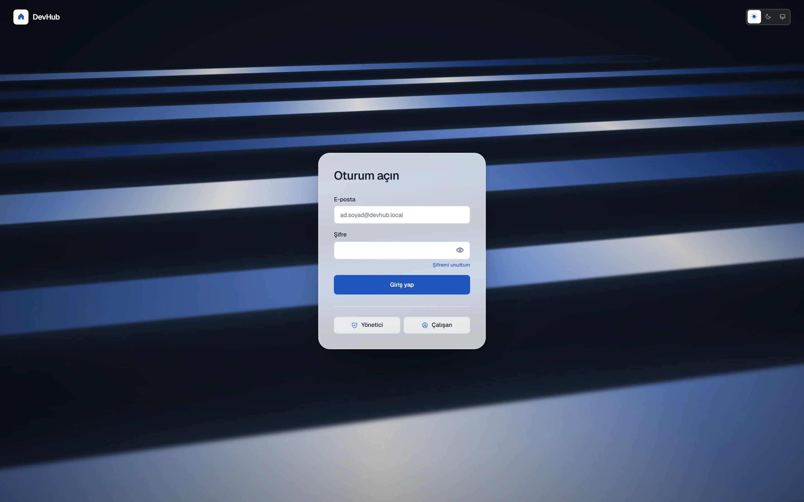

Sign in with your email and password. The buttons in the top right switch between light, dark and system theme.

If you forgot your password, press **Şifremi unuttum** (forgot password):

1. Enter your email; a 6-digit code is sent to it.
2. Enter the code (pasting works too).
3. Choose a new password.
4. The request goes to an admin. Once approved, the new password works; until then your old password keeps working.

When a password changes, your sessions on other devices are signed out for safety.

### Overview (Genel Bakış)

The first screen after signing in (the image at the top). **Bugünüm** (my day) holds today's cards; type in the box below it and press Enter to add one.

- Cards with a **blue background and square checkbox** come from tasks assigned to you (labelled "Görev · project name").
- Cards with a **round checkbox** are your own notes.

On the right: upcoming deadlines, your pending requests and a leave shortcut. Below: team status, announcements and recent activity.

### Personal to-dos (Yapılacaklarım)

**Yapılacaklarım** in the sidebar is your personal space; nobody else sees these cards (except lists you share).

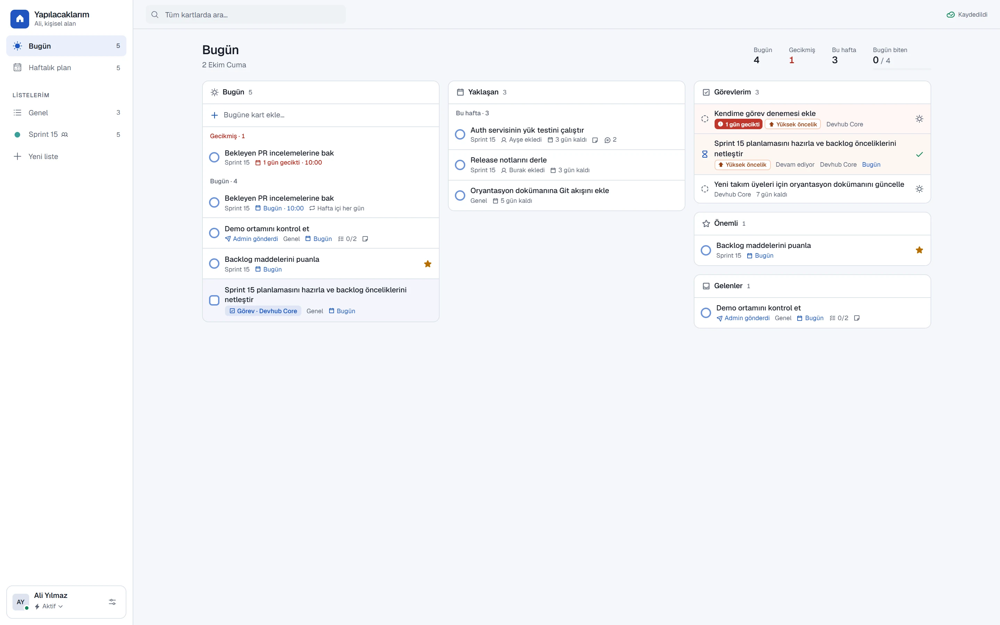

The **Bugün** (today) screen shows the whole day at a glance: today's and overdue cards, the coming days, tasks assigned to you, starred cards and cards teammates sent you.

- The **sun** button next to a task adds it to today's plan.
- Click a card for details: note, steps, date, reminder time and repeat (daily, weekdays, weekly, monthly).
- Everything saves as you type.

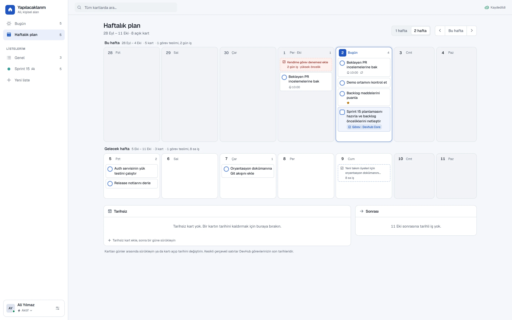

**Haftalık plan** (weekly plan) shows this week and next week; even on a Sunday you see Monday's big job. Drag cards between days to change their date. Dashed boxes are your task deadlines.

**Lists:** create a list in the sidebar and add teammates with **Paylaş** (share). In a shared list everyone sees, completes and comments on the cards.

### Tasks (Görevler)

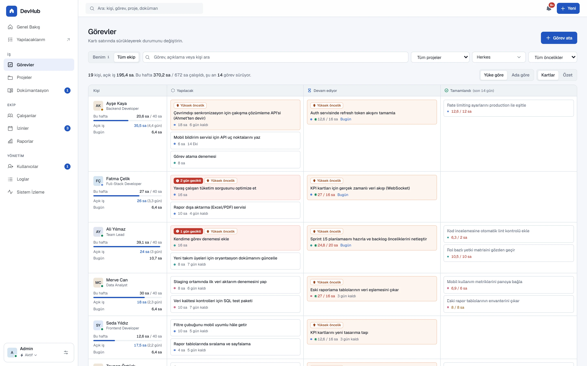

Each row is a person: hours worked this week, remaining work, and tasks in **To do / In progress / Done** columns.

- **Drag** a card to another column in the same row to change its status.
- **Red** cards are overdue, **orange** cards are high priority.
- Filters on top show only your work, one project, one department or one priority.
- People are grouped under **Departman** (department) or **Proje** (project) headings; groups collapse and your choice is remembered.
- The **Takvim** (calendar) view spreads the work over days: each task's remaining estimate is laid out in order over the person's working hours (8 hours a day, skipping weekends, holidays and leave), so you can see who finishes what by which day. Bar colours show how much room is left before the deadline: green relaxed, orange getting close (at most 2 working days to spare), red due today or not going to make it, blue no deadline; high-priority tasks also carry a double-arrow mark. Drag the calendar left and right to look back or ahead; click a bar to see its plan, remaining work and deadline in a card. A task appears as soon as it is assigned.
- The **Atanmamış** (unassigned) row at the top holds work nobody has yet. An admin drags a card onto a person's row to assign it.

The **Tablo** (table) view in the top right lists every task, assigned or not: open the **Atanmamış** tab to see waiting work, assign it from the **Atanan** column in one click, or select several tasks and assign them at once. Click a column header to sort. Employees can take an unassigned task with **Üstlen** (take on).

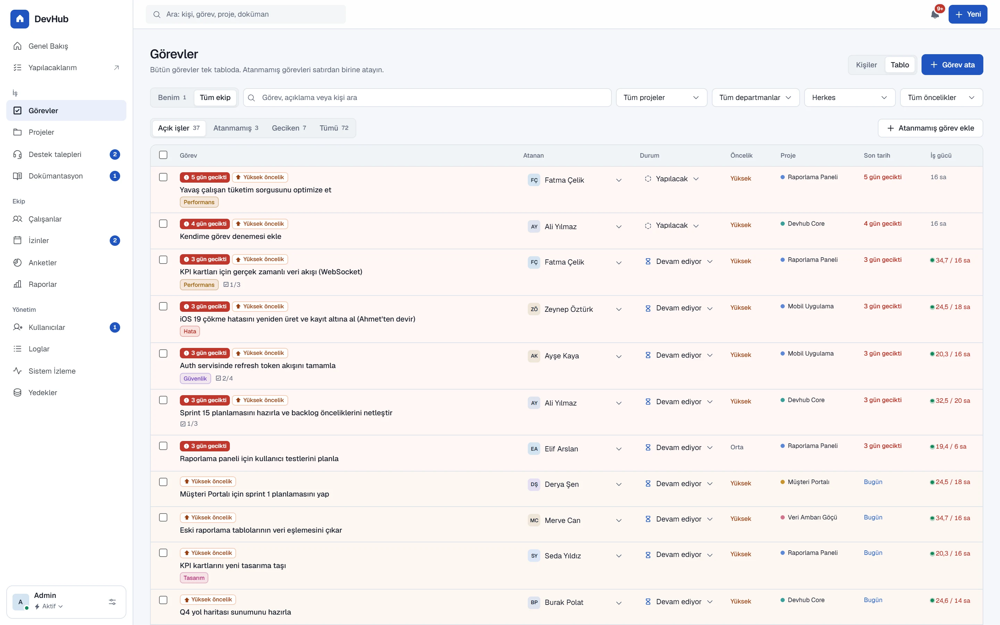

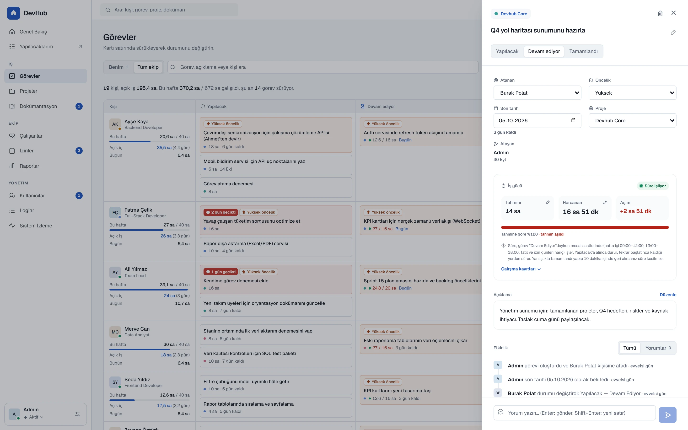

Clicking a card opens its details on the right: assignee, priority, deadline, description, comments and the full history. The **İş gücü** (effort) section shows the estimate, time spent so far and whether the estimate was exceeded. Time only counts during working hours while the task is in progress.

The details panel also has:

- **Labels** such as "customer bug" or "invoice"; type a new one to create it.
- **Subtasks** to split the work into steps; the card shows progress such as "1/3".
- **Dependencies:** pick the task that must finish first. This task cannot start until then, and you are notified when it can.
- **Files:** screenshots, PDFs and Office documents (up to 10 MB). Paste a screenshot straight in with **Ctrl+V**.

### Employees (Çalışanlar)

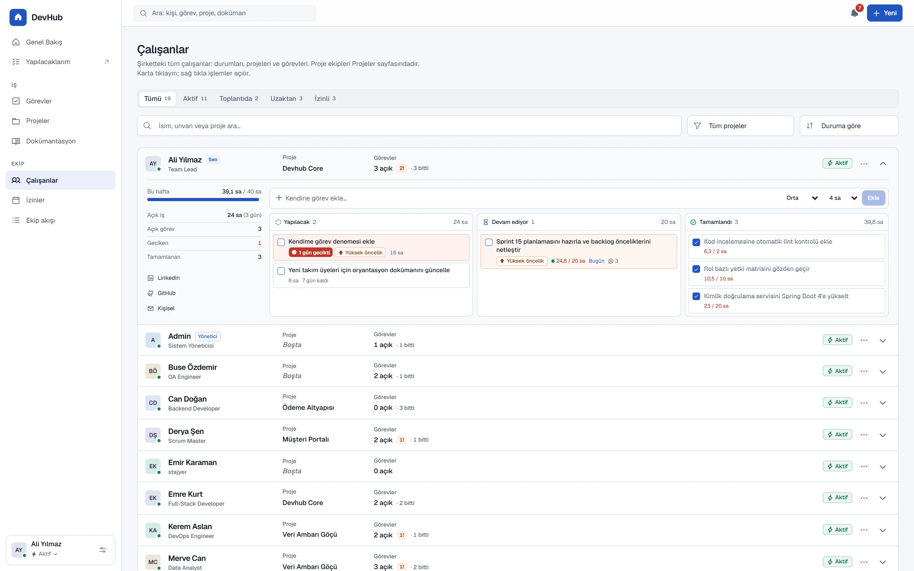

Everyone in the company with their status (active, in a meeting, remote, on leave), project and task count. Click a person to expand the row: weekly working time, tasks and contact links. You can add a task to yourself right from your own row.

Change your own status next to your name in the bottom left.

### Leave (İzinler)

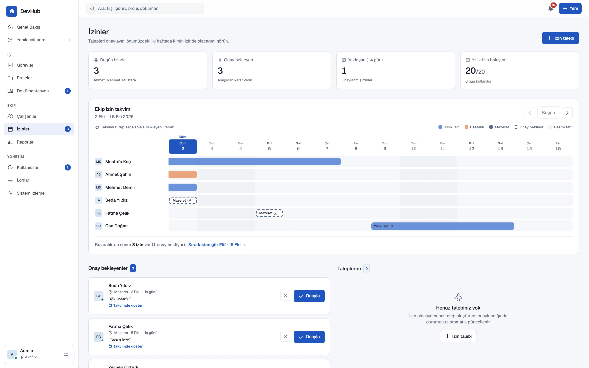

Create a request with **İzin talebi**; once an admin approves it, your status becomes "on leave" automatically on those days. Drag the team calendar left and right to look ahead. Your annual entitlement and remaining days are on this page. If your plans change, cancel an approved leave that has not started yet with **✕**; the days return to your balance. Annual and excuse requests whose dates pass without a decision close by themselves.

### Support tickets (Destek talepleri)

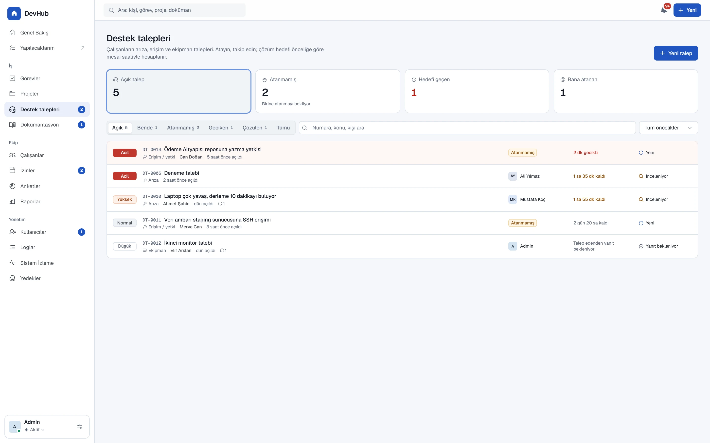

Laptop broken, VPN not connecting, need a new monitor? Send it to management with **Yeni talep** (new request). A ticket is always opened in your own name; pick its type (Arıza / something broken, Erişim / access, Ekipman / equipment, Diğer / other) and priority. The **resolution target** is calculated from the priority in working hours (urgent 4 hours, high 1 working day, normal 3 working days, low 5 working days).

- Employees only see tickets **they opened** and tickets **assigned to them**; admins see all of them.
- An admin assigns the ticket to whoever will solve it; the assignee can hand it back with **Bırak** (drop).
- If more information is needed the status is set to **Yanıt bekleniyor** (waiting for reply); the requester is notified and the ticket is not counted as late meanwhile.
- In the details panel, comment and attach screenshots (Ctrl+V). An admin or the assignee can use **Bu talepten görev oluştur** (create a task from this ticket) to put the work on the task board; when the task is done the ticket gets a note.

### Surveys (Anketler)

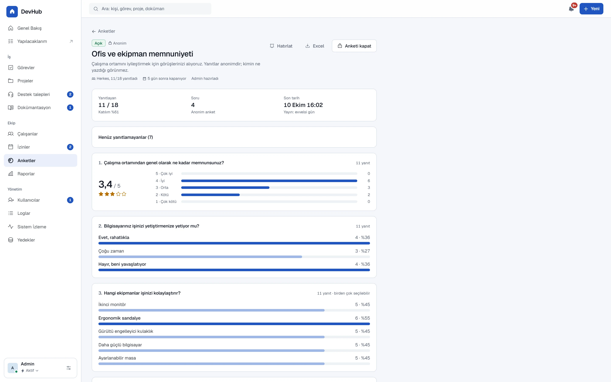

Admins create a survey from a template or from scratch under **Anketler → Yeni anket**: single choice, multiple choice, 1-5 rating and written answers. Send it to everyone, a department or chosen people; with a deadline it closes by itself.

- In an **anonymous** survey answers are never linked to a person; who answered is only visible as participation.
- Employees see pending surveys on the overview and as a count in the menu; answering takes a few minutes.
- Admins see charted results, send **Hatırlat** (reminders) to people who have not answered, and download answers as **Excel**.

### Documentation (Dokümantasyon)

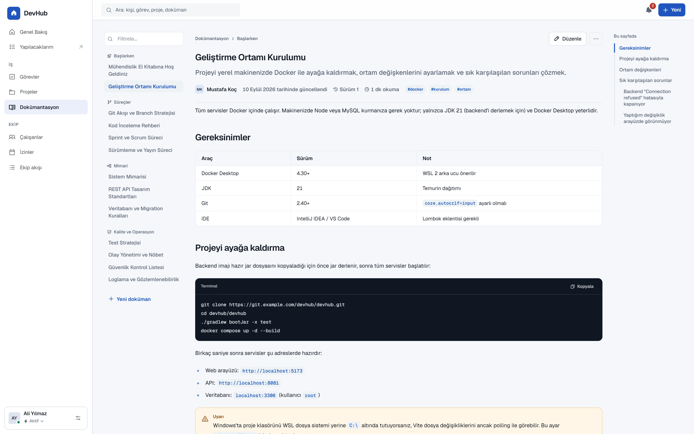

The team handbook: setup guides, processes, rules. Anyone can suggest changes with **Düzenle** (edit); tables, code blocks, images and callouts are supported. Employees' suggestions are published after admin approval, and old versions are kept.

### Admin screens

Admin accounts get a **Yönetim** (management) section in the sidebar.

| | |
|---|---|
| **Kullanıcılar** (users) | Add employees, edit names and job titles, assign roles and projects, deactivate accounts. A deactivated person's open tasks go back to the unassigned pool, their tickets back to management, and pending leave requests are cancelled. Password reset requests are approved here. |
| **Raporlar** (reports) | Workload, project progress, estimated vs. actual effort, leave usage. |
| **Loglar** (logs) | Who did what and when: sign-ins, task changes, approvals. Filterable and exportable to Excel. |
| **Sistem izleme** (monitoring) | Service health, CPU and memory usage, response times. |
| **Yedekler** (backups) | All data is backed up automatically every 3 days, or right away with **Şimdi yedek al**. Backups are kept in the `devhub/backups` folder on your computer, can be downloaded, and restored with **Bu yedeğe geri dön** (a backup of the current state is taken first). |

When adding or editing a user, set a **Departman** (department, e.g. Proje, Destek, Test): grouping and filters on the Tasks and Employees pages use it, and surveys can target a department. Only admins change names and job titles.

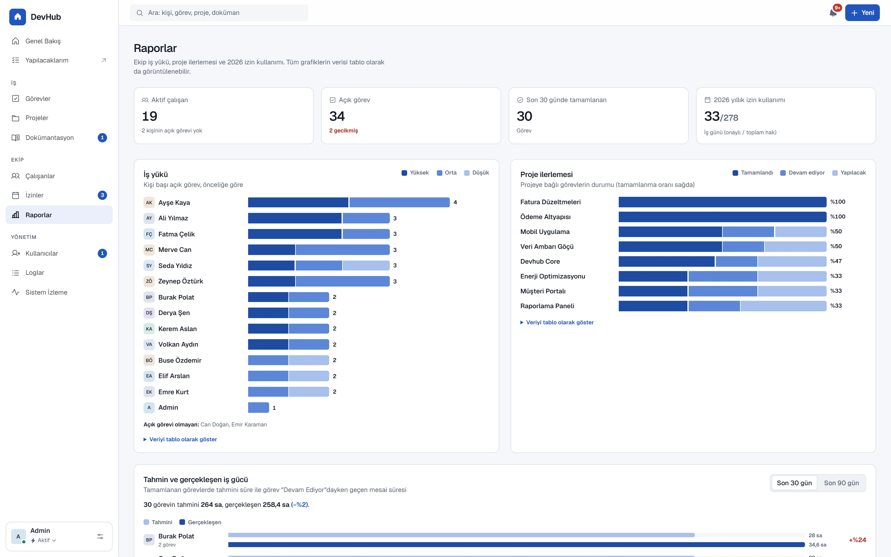

<details>
<summary>More screens</summary>

<br>

**Users**

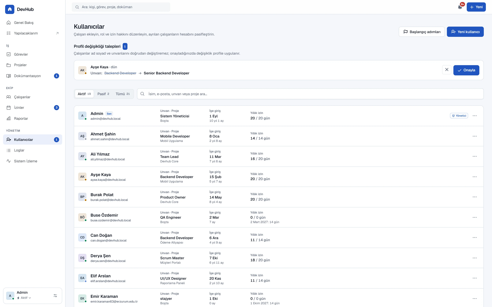

**System monitoring**

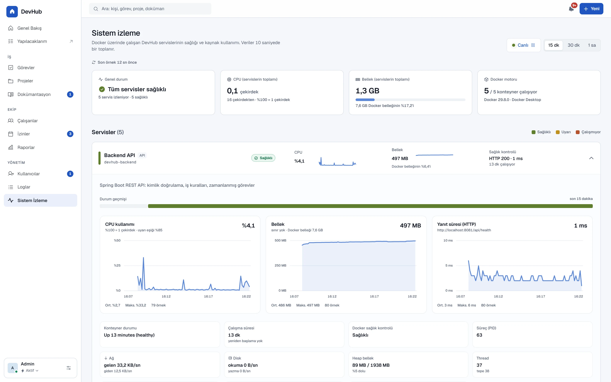

**Backups (Yedekler)**

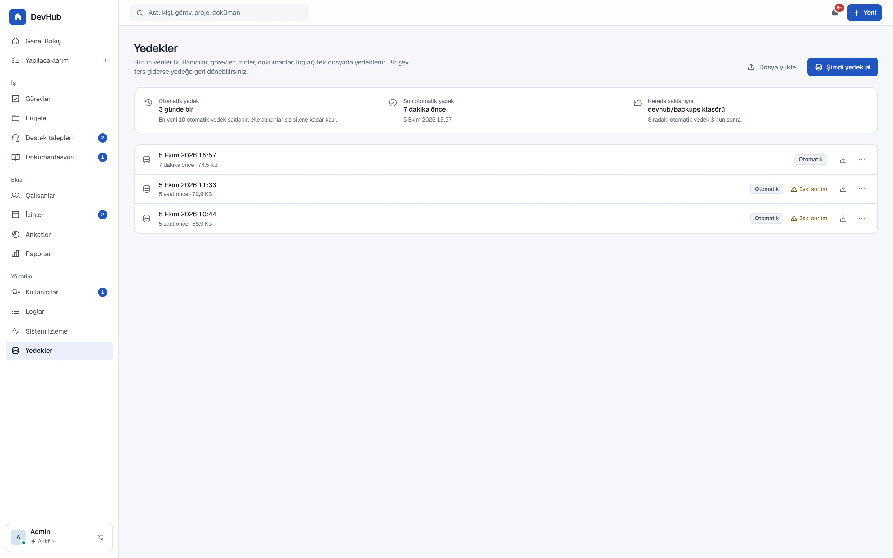

**Dark theme**

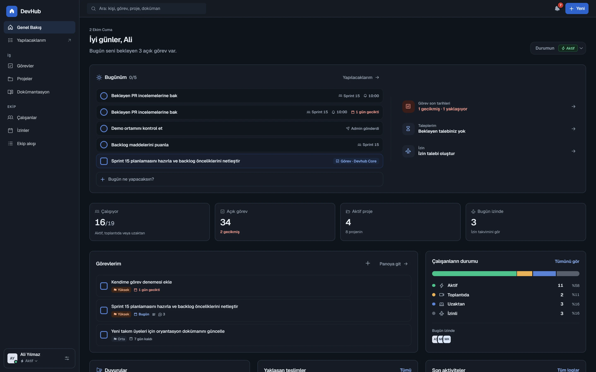

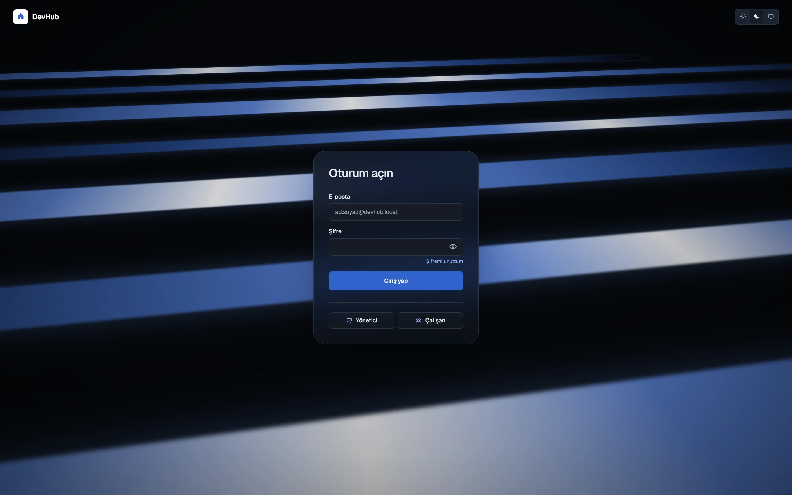

</details>

## Employee and admin

| | Employee | Admin |
|---|:---:|:---:|
| Add and update own tasks | ✓ | ✓ |
| Assign tasks to others | | ✓ |
| Take on an unassigned task | ✓ | ✓ |
| Open and comment on own support tickets | ✓ | ✓ |
| See and assign all tickets | | ✓ |
| Answer surveys | ✓ | ✓ |
| Create surveys and see results | | ✓ |
| Request leave | ✓ | ✓ |
| Approve leave | | ✓ |
| Edit documentation | as a suggestion | directly |
| Create projects, publish announcements | | ✓ |
| Users, reports, logs, monitoring, backups | | ✓ |

## Tips

- **Ctrl + K** (⌘ + K on Mac): search people, tasks, projects and docs; common commands.
- **Right click** works on every page: cards, rows and empty space open actions for that page.
- The **Yeni** (new) button in the top right: task, leave request, support ticket; for admins also project, announcement and survey.
- **Ayarlar → Görünüm** (settings → appearance): theme and interface size.
- Notifications are under the bell icon; the unread count also shows in the tab title.

## Troubleshooting

<details>
<summary>"port is already allocated"</summary>

Another program uses port 5173, 8081, 3306 or 8025 (often a local MySQL). Close it and run `docker compose up -d` again.

</details>

<details>
<summary>The page opens but sign-in fails</summary>

On the first start the backend needs about a minute to prepare the database. Check with:

```bash
docker compose ps
```

Try again when `devhub-backend` shows `healthy`.

</details>

<details>
<summary>No password reset code arrived</summary>

In a local setup emails are not delivered to real addresses; they land in the test mailbox at **http://localhost:8025**.

</details>

---

<div align="center">
<sub>Built with React, TypeScript, Tailwind CSS, Framer Motion · Spring Boot, MySQL, Flyway · Docker.</sub>
</div>
